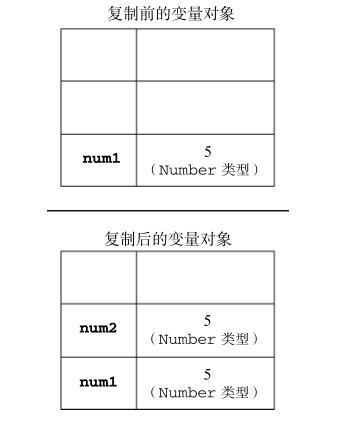
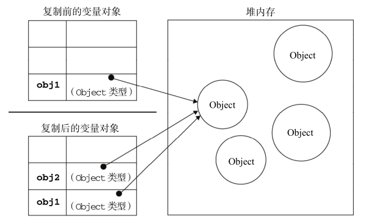

## 变量类型:基本类型和引用类型
js中包含两种不同的变量类型`基本类型` 和 `引用类型`
* 基本类型(undefined、null、Boolean、Number、String):可以直接操作保存在变量中的实际的值
* 引用类型(对象):引用类型的值是保存在内存中的对象，js不允许直接访问内存中的位置，也就是说不能直接操作对象的内存空间，在操作对象时，实际上操作的是对象的引用而不是实际的对象

## 变量复制
* 基本类型的变量复制:会在变量对象上创建一个新的值，然后把该值复制到位新变量分配的位置上，保存在栈内存中
```
var num1 = 5;
var num2 = num1;
```


* 引用类型的变量复制:复制引用类型的变量，同样会将存储的变量对象复制一份放到为新变量分配的空间中。不同的是，这个值的副本实际上是一个指针，而这个指针指向存储在堆内存中的对象上(左边的是栈内存，右边的是堆内存)。两个变量实际上引用的是同一个对象。因此其中一个变量的改变，也会影响到另一个变量
```
var obj1 = new Object();
var obj2 =obj1;
obj1.name = 'ylk';
console.log(obj2.name);//ylk
```



## 参数传递: js中的参数是`按值传递`还是`引用传递`???
先看下面两个例子:  
### 例1
```
function add(num){
 num+=10;
}
var a = 10;
add(10)
console.log(a);//10
```
### 例2
```
function setName(user){
  user.name = 'ylk'
}
var user = {age:12}
setName(user)
console.log(user)//{age:12,name:'ylk'}

function setName2(user){
  user.name = 'ylk'
  user = new Object();
  user.name = 'lizi'
}
var user = {age:12}
setName2(user)
console.log(user)//{age:12,name:'ylk'}
```
> 从例1中，我们可以看到，基本类型参数是`按值传递`，传递进去的参数在函数内部改变之后，并没有改变原参数的值； 而在例2的setName方法中我们会感觉引用类型的参数是引用传递，参数在函数内部改变之后，外部的参数也会受到影响，所以很多开发人员错误的认为:局部作用域中修改的对象在全局作用域中也会受到影响，说明参数是引用传递；但是通过setName2方法，我们可以很清楚的看到，如果引用类型的参数是引用传递，那么最后外部的user应该是{name:'lizi'}，因为它要指向另一个引用对象，但它的值依然是{age:12,name:'ylk'}，这说明即使在函数的内部修改了参数的值，但原始的引用仍然保持不变，在函数内部从写user对象的时候，这个变量引用的就是一个局部变量了，而这个局部变量会在函数执行完毕之后立即被销毁。所以js是包含两种值传递的类型，值传递和引用传递。~~所以其依然是按值引用;所以在js中所有的参数都是`引用传递`~~